# 🏢 Intrasync - Internal Company Portal for HR & Team Operations

Intrasync is an internal enterprise platform designed to centralize and streamline core HR and employee operations.
It supports essential workflows like employee management, daily work updates, resignations, event announcements,
ticket tracking, and more — helping teams collaborate efficiently and enabling HR to manage operations digitally.

## 📋 Table of Contents

-   [Features](#-features)
-   [Technologies Used](#-technologies-used)
-   [Installation](#-installation)
-   [Usage](#-usage)
-   [Folder Structure](#-folder-structure)
-   [Screenshots](#-screenshots)
-   [Contributing](#-contributing)
-   [License](#-license)

## 🚀 Features

-   **User Login & Authentication**
    -   JWT-based session management
-   **Employee Directory**
    -   Add, edit, filter, and manage employee profiles
-   **Daily Update of Work**
    -   Employees log their daily tasks and total hours
-   **Ticket Management System**
    -   Employees can raise, update, and track tickets
    -   HR/Admin can manage ticket status
-   **Resignation Workflow**
    -   Submit and process resignation applications
-   **Event Announcements**
    -   Post and manage internal company events
-   **Role-Based Access Control**
    -   Admin, HR, and Employee roles with permission gating

## 🛠️ Technologies Used

-   **Node.js** – Server-side JavaScript runtime
-   **Express.js** – Web framework for routing and middleware
-   **PostgreSQL** – Relational database
-   **Sequelize** – ORM for schema & data modeling
-   **JWT** – Secure token-based authentication
-   **Handlebars** – Email templating engine
-   **JavaScript (ES6+)** – Core language for logic and scripting

## 📥 Installation

1. Clone the repository

```bash
   git clone https://github.com/your-org/intrasync.git
   cd intrasync
```

2. Install dependencies

```bash
   npm install
```

3. Set up environment variables in `.env`

```bash
   DB_HOST=localhost
   DB_USER=youruser
   DB_PASS=yourpass
   DB_NAME=intrasync
   JWT_SECRET=your_jwt_secret
   EMAIL_USER=your_email@example.com
   EMAIL_PASS=your_email_password
```

4. Run database migrations and seeders

```bash
   npx sequelize-cli db:migrate
   npx sequelize-cli db:seed:all
```

5. Start the application

```bash
   npm start
```

## 📂 Folder Structure

```bash
project-root/
├── app.js                            # Entry point of the application
├── config/
│   └── config.js                     # Database and environment configuration
├── migrations/                       # Sequelize migration files for schema setup
│   ├── 20250612102401-create-users.js
│   ├── 20250612102551-create-employees.js
│   ├── 20250620041612-create-employeeDocuments.js
│   ├── 20250621060742-create-tickets.js
│   ├── 20250621060748-create-ticketDetails.js
│   ├── 20250621153105-create-settings.js
│   ├── 20250624112335-create-departments.js
│   ├── 20250624112401-create-designations.js
│   └── 20250628073836-create-dailyUpdates.js
├── models/                           # Sequelize models
│   ├── dailyUpdates.js
│   ├── departments.js
│   ├── designations.js
│   ├── employeeDocuments.js
│   ├── employees.js
│   ├── index.js                      # Sequelize initialization
│   ├── settings.js
│   ├── ticketDetails.js
│   ├── tickets.js
│   └── users.js
├── seeders/                          # Sequelize seed files for initial data
│   └── 20250626133037-seed-settings.js
├── src/
│   ├── controllers/                  # Route controllers for handling business logic
│   │   ├── dailyUpdateController.js
│   │   ├── employeeController.js
│   │   ├── loginController.js
│   │   ├── masterDataController.js
│   │   └── ticketController.js
│   ├── database/
│   │   └── db.js                     # Database connection instance
│   ├── emails/
│   │   └── templates/                # Handlebars email templates
│   │       ├── forgot-email.handlebars
│   │       └── reset-password-email.handlebars
│   ├── helper/
│   │   └── commonHelper.js          # Common utility functions
│   ├── middleware/
│   │   └── auth.js                  # Authentication middleware
│   ├── repository/                  # Repository pattern for DB interactions
│   │   ├── dailyUpdateRepo.js
│   │   ├── EmailRepo.js
│   │   ├── EmployeeRepo.js
│   │   ├── MasterDataRepo.js
│   │   ├── ticketRepo.js
│   │   └── UserRepo.js
│   └── router/                      # Express route definitions
│       ├── dailyUpdateRouter.js
│       ├── employeeRouter.js
│       ├── loginRouter.js
│       ├── masterDataRouter.js
│       └── ticketRouter.js

```

## 📸 Screenshots

### Intrasync Login

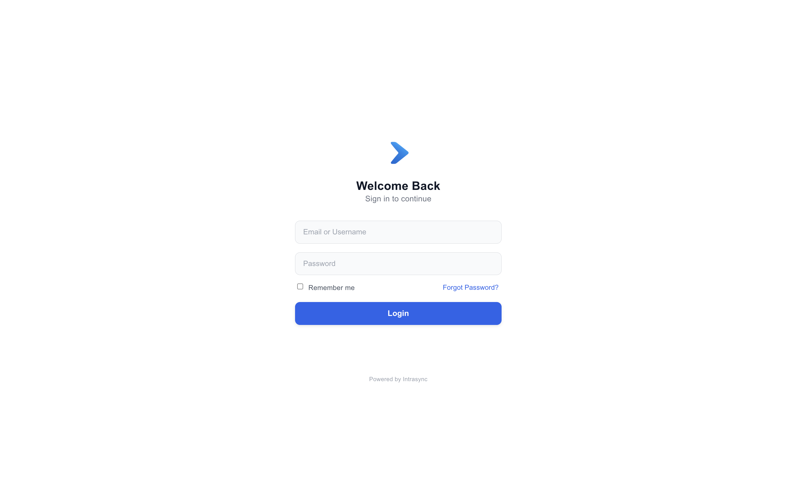

### Intrasync Forgot Password

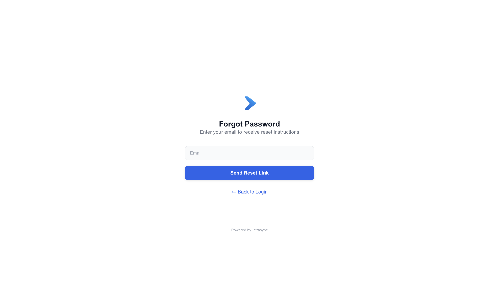

### Intrasync Home Page

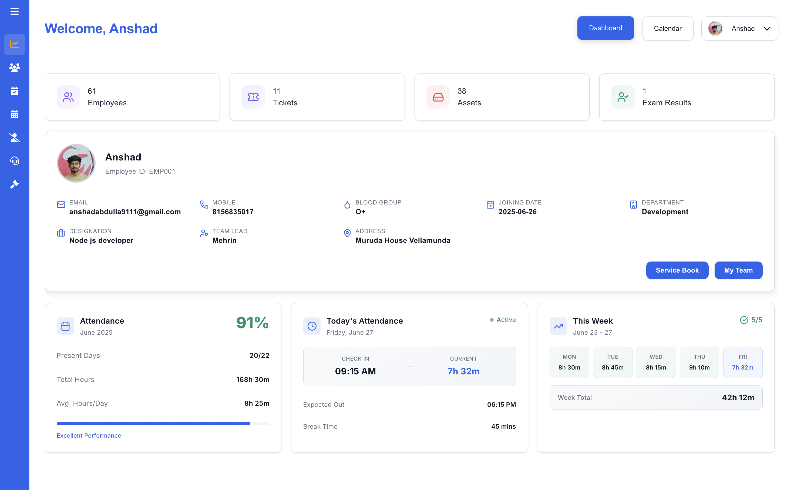

### Intrasync Employee Directory

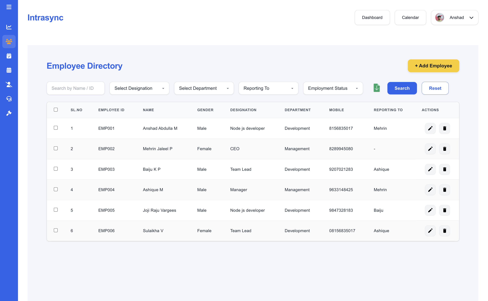

### Intrasync Add Employee

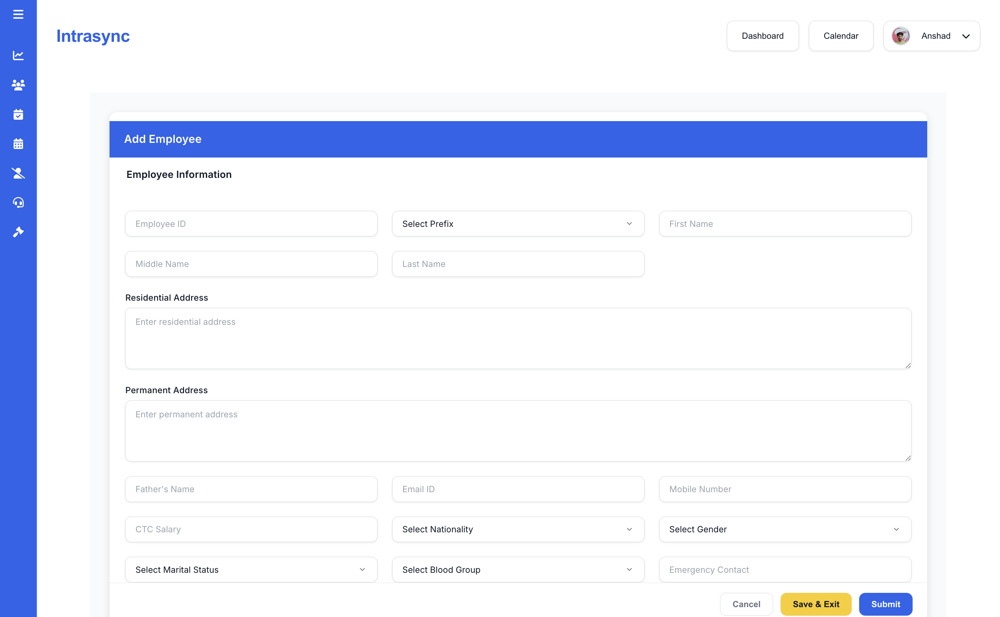

### Intrasync Update Employee

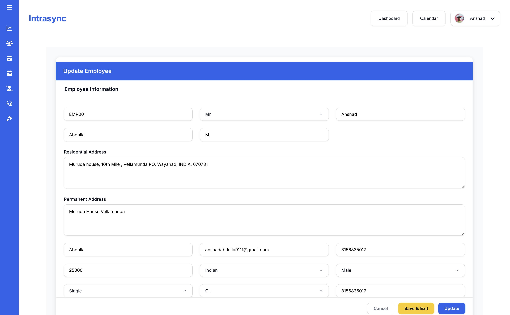

### Intrasync Ticket List

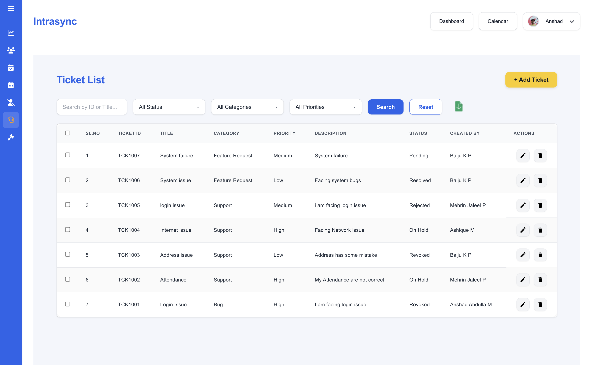

### Intrasync Update Ticket

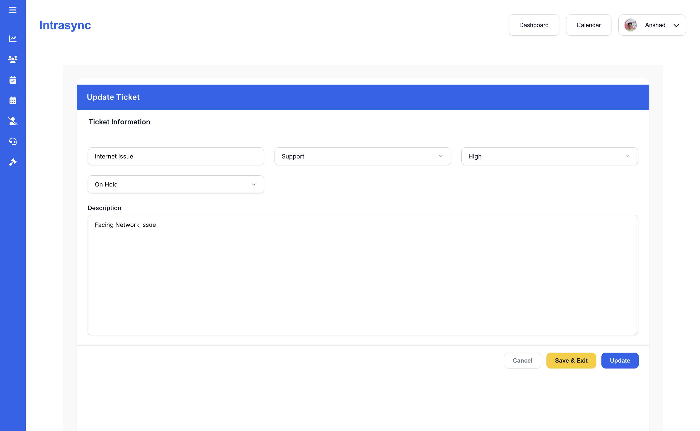

### Intrasync Daily Updates

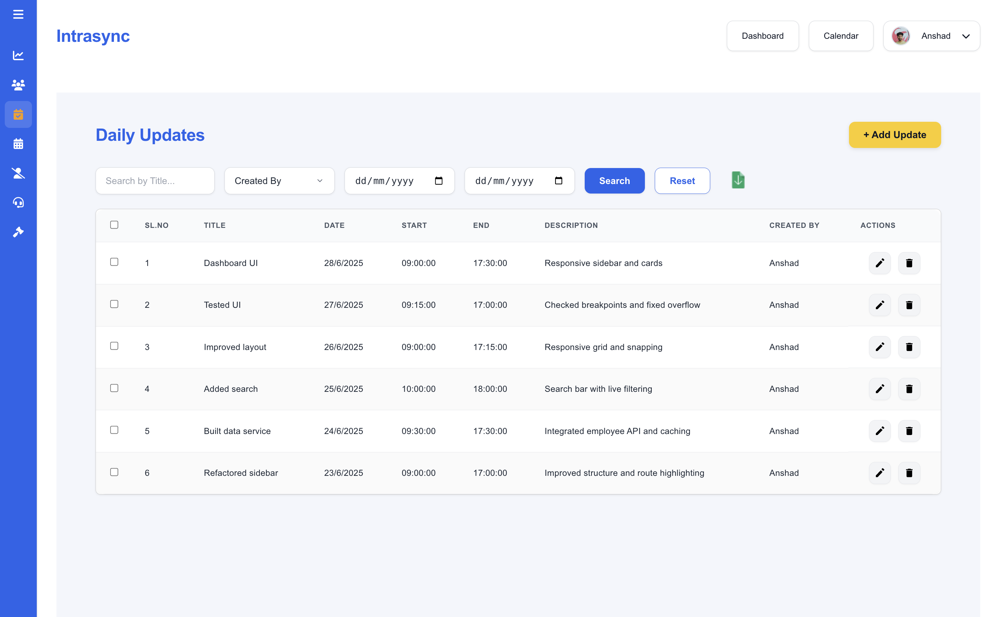

### Intrasync Daily Update Create

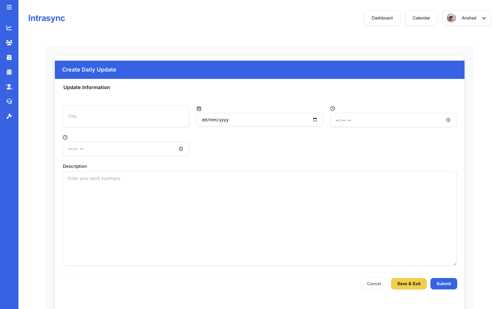

### Intrasync Daily Update Edit

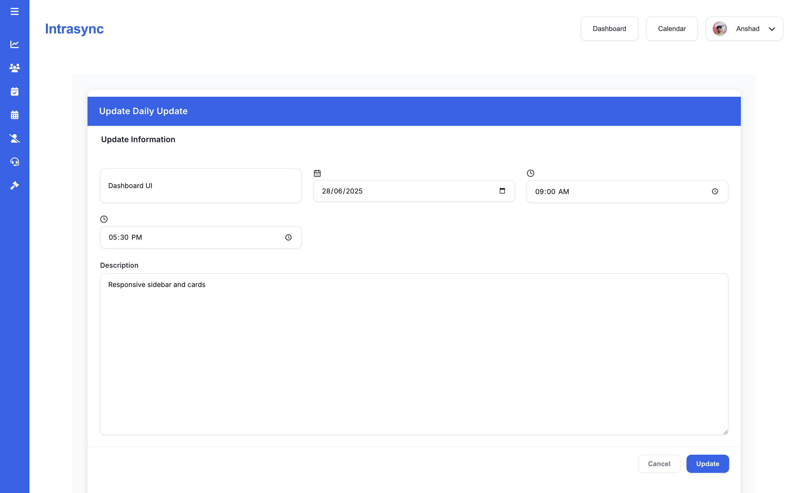

### Intrasync Reset Password

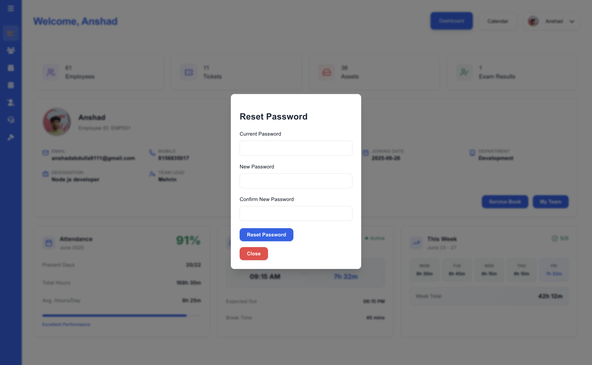

### Intrasync Forgot Password Mail Template

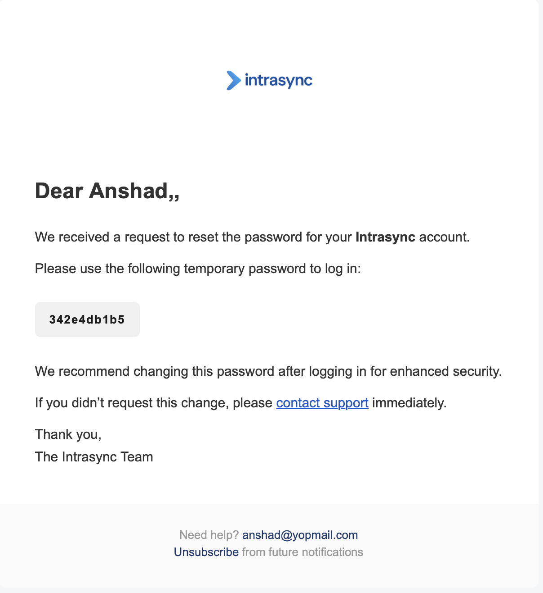

### Intrasync Reset Password Successful Mail

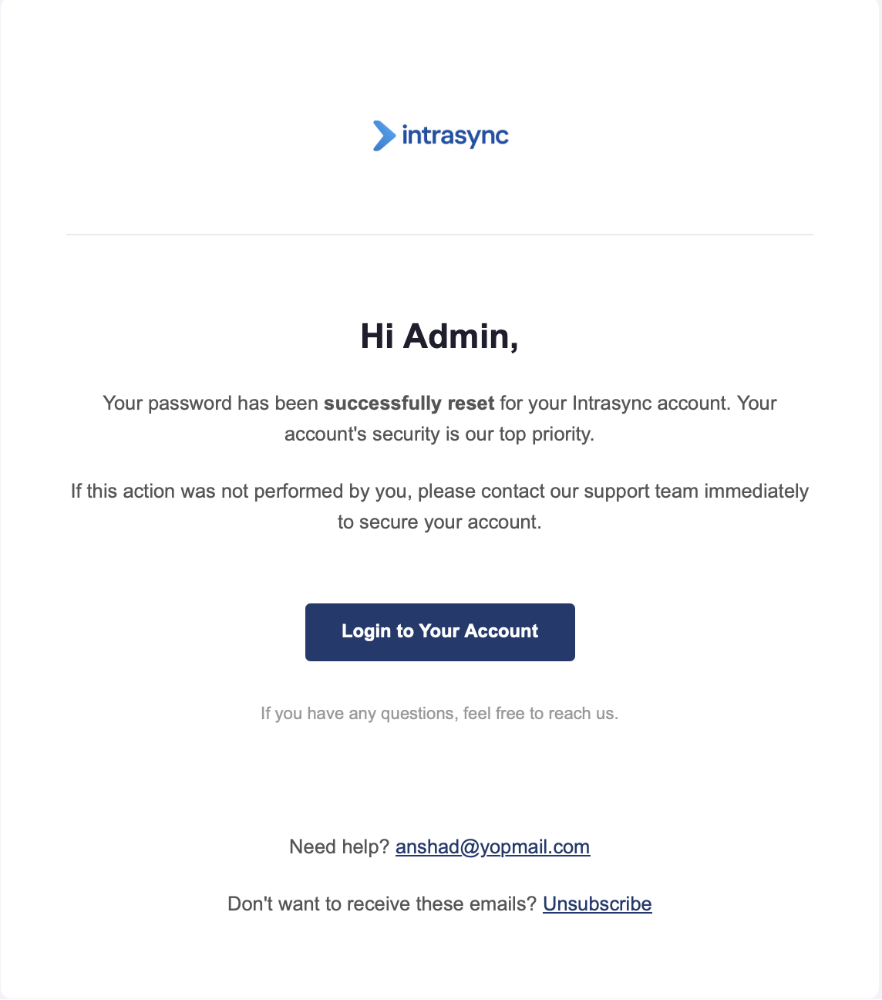

6. Contributing

This is a private, internal project. If you're a team member contributing to this platform:

-   Follow the existing code style
-   Create a feature branch
-   Submit a pull request with a clear description

7. License

This project is for internal use only and is not open-source.  
All rights reserved by the organization.
